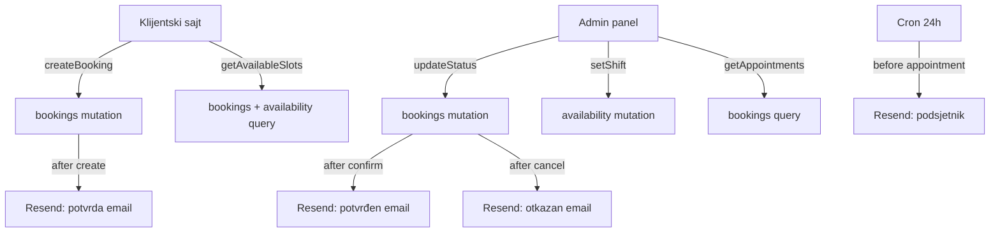

# ZenZone Backend — Convex + Resend.com

## Arhitektura



## Convex šema — `convex/schema.ts`

```ts
// services table (admin upravlja)
services: defineTable({
  name: string,
  duration: string,
  description: string,
  price: number,
  category: string,     // "masaze" | "parcijalni" | "hidzama"
  active: boolean,      // soft delete
})

// packages table
packages: defineTable({
  name: string,
  description: string,
  originalPrice: number,
  price: number,
  terms: string,
  active: boolean,
})

// bookings table
bookings: defineTable({
  serviceId: Id("services"),
  date: string,          // "2026-04-20"
  time: string,          // "09:00"
  mood: string,          // "tisina" | "muzika" | "razgovor"
  clientName: string,
  clientEmail: string,   // za Resend
  clientPhone: string,
  status: string,        // "čekanje" | "potvrđen" | "otkazan"
  medicalChecks: object, // { noBloodThinners, noAnemia, ... }
  referralSource: string,
}).index("by_date_time", ["date", "time"])
  .index("by_status", ["status"])

// availability table (smjene po danu)
availability: defineTable({
  date: string,          // "2026-04-20"
  shift: string,         // "smjena1" | "smjena2" | "medu" | "zatvoreno" | ""
  // "" = nije odabrano = svi slobodni
}).index("by_date", ["date"])

// loyalty table (praćenje dolazaka)
loyalty: defineTable({
  clientPhone: string,
  visitCount: number,
  lastVisit: string,
}).index("by_phone", ["clientPhone"])
```

## Convex funkcije

### Queries

```
convex/queries/
  services.ts      → getServices, getServicePackages
  bookings.ts      → getBookings(filters), getBookingsByDate(date), getBooking(id)
  availability.ts  → getWeekAvailability(offset), getAvailableSlots(date)
  loyalty.ts       → getLoyaltyByPhone(phone)
```

**getAvailableSlots(date)** — kombinuje availability + bookings:

1. Dobavi shift za taj datum iz `availability` tabele
2. Ako nema zapisa → svi sati slobodni
3. Ako shift = "zatvoreno" → prazan niz
4. Inače: sati VAN smjene = slobodni, sati UNUTAR smjene = zauzeti
5. Oduzmi već rezervisane termine za taj datum
6. Uračunaj 15-min buffer između termina

### Mutations

```
convex/mutations/
  services.ts      → addService, updateService, toggleService
  bookings.ts      → createBooking, updateBookingStatus, cancelBooking
  availability.ts  → setShift(date, shift), setWeekShifts(offset, shifts[])
  loyalty.ts       → incrementVisit(phone)
```

**createBooking flow:**

1. Provjeri da li je slot slobodan (getAvailableSlots)
2. Kreiraj booking sa status "čekanje"
3. Inkrementiraj loyalty counter
4. Pozovi Resend email → klijentu "Termin primljen"
5. Pozovi Resend email → adminu "Novi termin"

## Resend Email — `convex/emails.ts`

Koristi Resend.com API pozivom iz Convex akcije (HTTP action):

```
convex/actions/
  emails.ts  → sendEmail({ to, subject, html })
```

### Email predlošci (HTML)

| Okidač | Prima | Subject | Sadržaj |
|--------|-------|---------|---------|
| createBooking | Klijent | "Termin primljen — ZenZone" | Detalji termina, napomena za vodu |
| updateBooking → potvrđen | Klijent | "Termin potvrđen — ZenZone" | Detalji, podsjetnik za dolazak |
| updateBooking → otkazan | Klijent | "Termin otkazan — ZenZone" | Obavijest o otkazivanju |
| Cron 24h prije | Klijent | "Podsjetnik: sutra termin" | Datum, vrijeme, usluga, savjet za vodu |
| createBooking | Admin | "Novi termin — ZenZone" | Detalji + brzi link potvrde |

## Convex Cron — `convex/cron.ts`

```ts
// Svaki dan u 08:00 — šalje podsjetnike za sutrašnje termine
crons.dailyReminders: "0 8 * * *" → sendReminderEmails action
```

## Environment varijable u Convex

```
RESEND_API_KEY    — Resend.com API ključ
ADMIN_EMAIL       — email za obavještenja o novim terminima
```

## Frontend migracija (šta se mijenja)

```
src/
  lib/convex.ts              → Convex client setup (URL + provider)
  hooks/
    useConvexBookings.ts     → zamjenjuje useState mockAppointments
    useConvexAvailability.ts → zamjenjuje useState availability
    useConvexServices.ts     → zamjenjuje hardkodovane services
  components/
    CalendarPicker.tsx       → poziva getAvailableSlots query umjesto getMockSlots
    BookingSummary.tsx       → poziva createBooking mutation
    admin/WeekAvailability   → poziva setShift mutation
    admin/AppointmentTable   → poziva getBookings + updateBookingStatus
    admin/DayOverview        → poziva getBookingsByDate("today")
```

**BookingSummary dodaje:**

- `clientName`, `clientEmail`, `clientPhone` input polja u zadnjem koraku
- Umjesto `alert()`, poziva `createBooking` mutation
- Success → prikazuje poruku "Termin primljen, provjeri email!"

**Loyalty badge:**

- Na klijentskoj strani, ako klijent unese isti broj telefona, prikazuje se badge sa brojem dosadašnjih posjeta

## Koraci implementacije

1. `npm install convex` + Convex projekt setup (`npx convex dev`)
2. Kreirati `convex/schema.ts` sa svim tabelama
3. Kreirati queries (services, bookings, availability)
4. Kreirati mutations (createBooking, updateStatus, setShift...)
5. Kreirati email action sa Resend API pozivima
6. Kreirati cron za dnevne podsjetnike
7. Setup Convex client u frontend (`src/lib/convex.ts`)
8. Migrirati BookingFlow da koristi Convex mutations
9. Migrirati CalendarPicker da koristi Convex query za slotove
10. Migrirati Admin da koristi Convex queries/mutations
11. Ukloniti mock podatke iz `data/` fajlova
12. Testirati end-to-end flow

## Ključne odluke

- **Booking uvijek ide u "čekanje"** — admin potvrđuje ručno
- **Email obavezno** — klijent mora unijeti email pri zakazivanju
- **Loyalty** se računa po broju telefona (ne email)
- **Smjene se čuvaju po datumu** u Convex — nema week-level zapisa, svaki dan zasebno
- **Resend se poziva iz Convex HTTP action** — ne iz mutationa (mutations moraju biti determinističke)
- **Services/Packages** se mogu uređivati iz admina kasnije — za sada se seed-aju iz Convex seed funkcije
